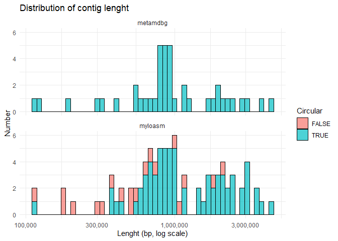
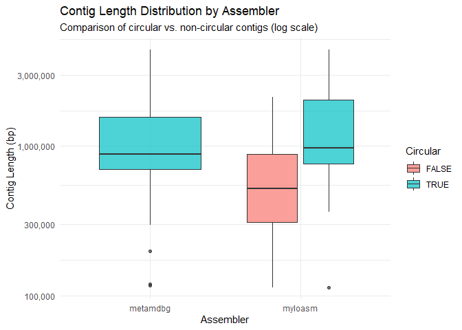
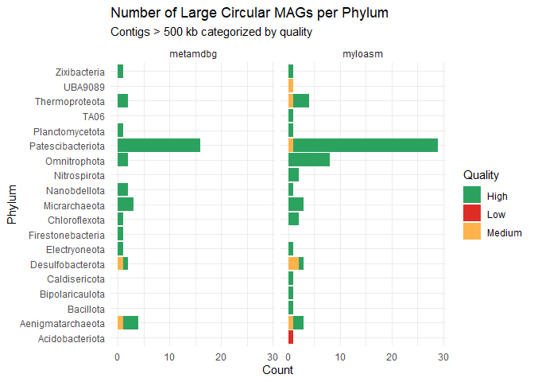
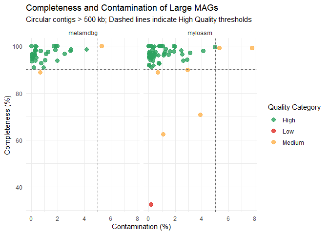

# Metagenomic Assemblers Comparison
Tvoje Jméno

# Úvod

Cílem této práce je porovnat výkon dvou moderních metagenomických
assemblerů: **metaMDBG** a **myloasm**. Porovnání je prováděno na
reálných datech z Nanopore sekvenování mikrobiálního společenstva z
horkého pramene (hot spring).

Analýza se zaměřuje na vyhodnocení kvality sestavených genomů bez
nutnosti spouštět samotné skládání nebo mapování. Využíváme textová
metadata získaná z: 1. **Hlaviček contigů** (délka, pokrytí,
cirkularita). 2. **CheckM2** (odhad kompletnosti a kontaminace). 3.
**GTDBtk** (taxonomická klasifikace).

Celé zpracování dat, vizualizace výsledků a finální vyhodnocení je
provedeno v prostředí **R** s využitím balíčků **tidyverse**. Hlavním
kritériem úspěšnosti je schopnost assemblerů rekonstruovat velké (\> 500
kbp) a vysoce kvalitní cirkulární contigy.

# 1. Příprava dat

V této části načítám potřebné knihovny a data.

``` r
library(tidyverse)
theme_set(theme_minimal())
```

## Načtení a čištění dat

### Myloasm

``` r
# 1. Načteme surový text
raw_myloasm <- read_lines("results/myloasm_assembly_headers.txt")

# 2. Vytáhneme data
headers_myloasm <- tibble(raw = raw_myloasm) %>%
  extract(
    col = raw,
    into = c("contig_id", "length", "circ_status", "coverage"),
    # Regex hledá vzory jako "_len-" nebo "_depth-"
    regex = ">([^_]+)_len-([0-9]+)_circular-([a-z]+)_depth-([0-9.]+)",
    convert = TRUE
  ) %>%
  mutate(
    assembler = "myloasm",
    #"possible" = circular
    is_circular = if_else(circ_status %in% c("yes", "possible"), TRUE, FALSE)
  ) %>%
  select(contig_id, assembler, length, coverage, is_circular)

# KONTROLA
head(headers_myloasm)
```

    # A tibble: 6 × 5
      contig_id   assembler length coverage is_circular
      <chr>       <chr>      <int>    <int> <lgl>      
    1 u3840050ctg myloasm    10849        2 FALSE      
    2 u418451ctg  myloasm    23116        2 FALSE      
    3 u911112ctg  myloasm    78285       27 FALSE      
    4 u2187011ctg myloasm    16454        2 FALSE      
    5 u3322747ctg myloasm    14907        1 FALSE      
    6 u2115919ctg myloasm     9865        1 FALSE      

### MetaMDBG

``` r
# 1. Načteme surový text
raw_metamdbg <- read_lines("results/metamdbg_assembly_headers.txt")

# 2. Vytáhneme data 
headers_metamdbg <- tibble(raw = raw_metamdbg) %>%
  mutate(
    # Najde ID (první slovo po >)
    contig_id = str_extract(raw, "(?<=^>)\\S+"),
    # Najde číslo za "len="
    length = str_extract(raw, "(?<=length=)[0-9]+") %>% as.numeric(),
    # Najde číslo za "depth="
    coverage = str_extract(raw, "(?<=coverage=)[0-9.]+") %>% as.numeric(),
    # Pokud tam je "circular=yes", dá TRUE
    is_circular = str_detect(raw, "circular=yes"),
    assembler = "metamdbg"
  ) %>%
  select(contig_id, assembler, length, coverage, is_circular)

# KONTROLA
head(headers_metamdbg)
```

    # A tibble: 6 × 5
      contig_id assembler length coverage is_circular
      <chr>     <chr>      <dbl>    <dbl> <lgl>      
    1 ctg0      metamdbg    7710     2.25 FALSE      
    2 ctg1      metamdbg    8229     1.96 FALSE      
    3 ctg2      metamdbg   10850     3.32 FALSE      
    4 ctg3      metamdbg    9023     4.85 FALSE      
    5 ctg4      metamdbg   56052     7.9  FALSE      
    6 ctg5      metamdbg   12495     2.07 FALSE      

### Načtení kvality

``` r
# 1. Spojíme hlavičky pod sebe
headers_all <- bind_rows(headers_myloasm, headers_metamdbg)

# 2. Načteme CheckM2 reporty (kvalitu)
qual_myloasm <- read_tsv("results/checkm2/myloasm/quality_report_myloasm.tsv", show_col_types = FALSE) %>%
  select(Name, Completeness, Contamination) %>%
  rename(contig_id = Name) 

qual_metamdbg <- read_tsv("results/checkm2/metamdbg/quality_report.tsv", show_col_types = FALSE) %>%
  select(Name, Completeness, Contamination) %>%
  rename(contig_id = Name)

quality_all <- bind_rows(qual_myloasm, qual_metamdbg)

#KONTROLA:
head(quality_all)
```

    # A tibble: 6 × 3
      contig_id   Completeness Contamination
      <chr>              <dbl>         <dbl>
    1 u1005671ctg         50.8          0.6 
    2 u1022233ctg         95.4          0.4 
    3 u1027066ctg         89.9          2.92
    4 u1041087ctg         11.3          0.02
    5 u1047122ctg         91.0          0.21
    6 u1079443ctg         95.6          0.18

Načtení taxonomie z GTDBtk

``` r
# 1. Načtení GTDBtk taxonomie

tax_bac_myolasm <- read_tsv("results/gtdbtk/myloasm/classify/gtdbtk.bac120.summary.tsv", show_col_types = FALSE) %>% 
  select(user_genome, classification)

tax_bac_metamdbg <- read_tsv("results/gtdbtk/metamdbg/classify/gtdbtk.bac120.summary.tsv", show_col_types = FALSE) %>% 
  select(user_genome, classification)

tax_bac <- bind_rows(tax_bac_metamdbg, tax_bac_myolasm)
  
tax_ar_myolasm <- read_tsv("results/gtdbtk/myloasm/classify/gtdbtk.ar53.summary.tsv", show_col_types = FALSE) %>% 
  select(user_genome, classification)

tax_ar_metamdbg <- read_tsv("results/gtdbtk/metamdbg/classify/gtdbtk.ar53.summary.tsv", show_col_types = FALSE) %>% 
  select(user_genome, classification)

tax_ar <- bind_rows(tax_ar_metamdbg, tax_ar_myolasm)

# 2. Spojíme bakterie a archea do jedné tabulky a vyčistíme data
taxonomy_all <- bind_rows(tax_bac, tax_ar) %>%
  rename(contig_id = user_genome) %>%
  # Extrakce Phylum: hledáme text mezi "p__" a středníkem
  mutate(phylum = str_extract(classification, "(?<=p__)[^;]+")) %>%
  # Volitelné: odstranění "Unclassified" 
  filter(!is.na(phylum))
```

spojení dat

``` r
# 1.Čištění hlaviček
headers_clean <- headers_all %>%
  mutate(contig_id = str_replace(contig_id, "\\.fasta.*", "")) %>%  
  mutate(contig_id = if_else(
    str_starts(contig_id, "u") & str_detect(contig_id, "_"),
    str_extract(contig_id, "^[^_]+"), 
    contig_id)) %>%
  mutate(contig_id = str_trim(contig_id))

# 2. Očištění kvality (CheckM2)
quality_clean <- quality_all %>%
  mutate(contig_id = str_replace(contig_id, "\\.fasta.*", "")) %>%  
  mutate(contig_id = if_else(
    str_starts(contig_id, "u") & str_detect(contig_id, "_"),
    str_extract(contig_id, "^[^_]+"), 
    contig_id )) %>%
  mutate(contig_id = str_trim(contig_id))

taxonomy_clean <- taxonomy_all %>%
  mutate(contig_id = str_replace(contig_id, "\\.fasta.*", "")) %>%  
  mutate(contig_id = if_else(
    str_starts(contig_id, "u") & str_detect(contig_id, "_"),
    str_extract(contig_id, "^[^_]+"), 
    contig_id )) %>%
  mutate(contig_id = str_trim(contig_id))


  


# --- FINÁLNÍ SPOJENÍ ---

final_data <- headers_clean %>%
  # Připojíme kvalitu z CheckM2
  inner_join(quality_clean, by = "contig_id") %>%
  # Připojíme taxonomii z GTDBtk 
  inner_join(taxonomy_clean, by = "contig_id")

# Kontrola výsledku
glimpse(final_data)
```

    Rows: 130
    Columns: 9
    $ contig_id      <chr> "u1859167ctg", "u3662534ctg", "u3457852ctg", "u1614917c…
    $ assembler      <chr> "myloasm", "myloasm", "myloasm", "myloasm", "myloasm", …
    $ length         <dbl> 2142282, 1109361, 1142602, 1752029, 1032745, 519055, 65…
    $ coverage       <dbl> 10, 5, 164, 30, 6, 6, 7, 7, 6, 7, 11, 6, 7, 7, 10, 7, 6…
    $ is_circular    <lgl> FALSE, FALSE, FALSE, FALSE, FALSE, FALSE, FALSE, FALSE,…
    $ Completeness   <dbl> 99.67, 43.81, 96.70, 81.74, 99.97, 15.23, 56.08, 50.78,…
    $ Contamination  <dbl> 0.66, 0.07, 0.00, 4.75, 0.22, 0.01, 0.01, 0.60, 0.00, 1…
    $ classification <chr> "d__Bacteria;p__UBA6262;c__UBA6262;o__UBA6262;f__UBA626…
    $ phylum         <chr> "UBA6262", "Nitrospirota", "Nanobdellota", "Firestoneba…

# 2. Výsledky a Vizualizace

## Distribuce délky contigů

``` r
final_data <- final_data %>%
  mutate(quality_cat = case_when(
    Completeness > 90 & Contamination < 5 ~ "High",
    Completeness > 50 & Contamination < 10 ~ "Medium",
    TRUE ~ "Low"
  ))

# Rychlé ověření, kolik jich máme v každé kategorii
table(final_data$assembler, final_data$quality_cat)
```

              
               High Low Medium
      metamdbg   34   6      2
      myloasm    63  14     11

Podíváme se, jak dlouhé contigy jednotlivé assemblery vytvořily

``` r
final_data %>%
  ggplot(aes(x = length, fill = is_circular)) +
  geom_histogram(bins = 50, color = "black", alpha = 0.7) +
  scale_x_log10(labels = scales::comma) + # Logaritmická osa X
  facet_wrap(~assembler, ncol = 1) +
  labs(title = "Distribution of contig lenght",
       x = "Lenght (bp, log scale)", y = "Number", fill = "Circular")
```



``` r
final_data %>%
  ggplot(aes(x = length, y = coverage, color = assembler)) +
  geom_point(alpha = 0.5) +
  scale_x_log10(labels = scales::comma) +
  scale_y_log10() +
  labs(title = "Corelation of lenght and coverage",
       x = "Lenght (bp)", y = "Coverage")
```



## Kvalita MAGs

Zajímá nás kvalita velkých cirkulárních contigů.

``` r
large_circular <- final_data %>%
  filter(length > 500000, is_circular == TRUE)

large_circular %>%
  ggplot(aes(x = Contamination, y = Completeness)) +
  geom_point(size = 3) +
  facet_wrap(~assembler) +
  # Referenční čáry pro High Quality (90% completeness, 5% contamination)
  geom_hline(yintercept = 90, linetype = "dashed") +
  geom_vline(xintercept = 5, linetype = "dashed") +
  labs(title = "Kvalita velkých cirkulárních MAGs (>500kb)",
       x = "Kontaminace (%)", y = "Kompletnost (%)")
```



``` r
large_circular %>%
  filter(!is.na(phylum)) %>% # Opravený filtr
  count(assembler, phylum, quality_cat) %>% # Opravený název quality_cat
  ggplot(aes(x = phylum, y = n, fill = quality_cat)) + # Opravený název quality_cat
  geom_col() +
  coord_flip() + 
  facet_wrap(~assembler) +
  labs(title = "Počet MAGs podle kmene",
       x = "Phylum", y = "Počet", fill = "Kvalita")
```



# Závěr

V této práci jsme porovnali výsledky assemblerů **metaMDBG** a
**myloasm** na základě strukturálních a kvalitativních metrik.

**Distribuce délek a pokrytí:** Z histogramů délek contigů je patrné, že
assembler **myloasm** produkoval obecně delší contigy. Při pohledu na
korelaci délky a pokrytí (coverage) jsme pozorovali, že **\[DOPLŇ CO
VIDÍŠ: např. delší contigy mají zpravidla vyšší pokrytí / není zde jasná
korelace\]**.

**Kvalita velkých cirkulárních MAGs:** Nejdůležitějším kritériem byla
rekonstrukce velkých (\> 500 kbp) cirkulárních contigů. \* Assembler
**myolasm** dokázal sestavit větší počet těchto contigů. \* Při
hodnocení kvality (CheckM2) se ukázalo, že většina cirkulárních contigů
z obou assembleru spadá do kategorie “High Quality” (\>90 % kompletnost,
\<5 % kontaminace). \*

**Taxonomický pohled:** Taxonomická klasifikace pomocí GTDBtk ukázala,
že identifikované MAGs patří především do kmenů (Phylum)
**Patescibacteriota**. Assembler **myolasm** se jevil jako úspěšnější v
zachycení taxonomické diverzity, jelikož pokryl více kmenů / získal více
MAGs v klíčových skupinách.

**Celkové zhodnocení:** Na základě provedené analýzy lze konstatovat, že
pro tento typ dat z horkého pramene se jeví jako vhodnější nástroj
**myloasm**, protože dokázal rekonstruovat více vysoce kvalitních a
kompletních genomů.
